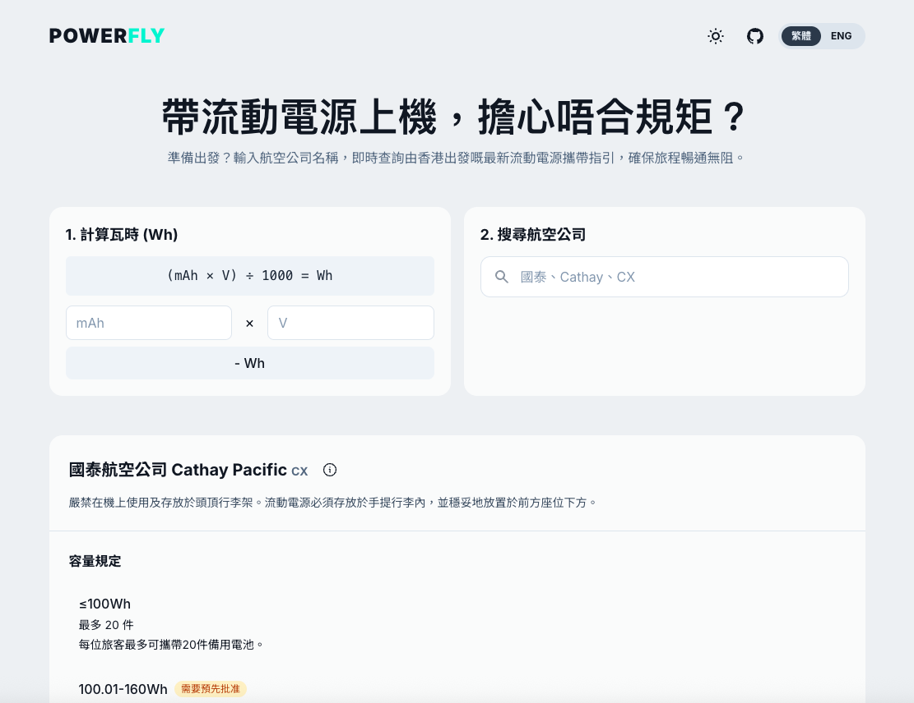

# Flight Power Rules

A simple web application that helps travelers check power bank regulations for different airlines.

## Features

- Search airlines by name or IATA code
- Bilingual support (English/Traditional Chinese)
- Dark/Light mode themez
- Essential knowledge section
- Mobile-friendly responsive design

## Live Demo

Visit [https://himphen.github.io/power-fly](https://himphen.github.io/power-fly/)



## Development

This is a static HTML website using:

- HTML5
- Tailwind CSS v4
- Google Fonts

### Local Development

1. Clone the repository:
```bash
git clone https://github.com/himphen/power-fly.git
cd power-fly
```

2. Install dependencies:
```bash
npm install
```

3. Start development server:
```bash
npm run dev
```

4. Open `index.html` in your browser. You can use any local server, for example:
```bash
python -m http.server 8000
# or
npx serve
```

### Build for Production

```bash
npm run build
```

### Deploy to GitHub Pages

1. Push your changes to the `main` branch
2. Go to your repository settings
3. Under "GitHub Pages", select:
   - Source: Deploy from a branch
   - Branch: main
   - Folder: / (root)
4. Click Save
5. Your site will be available at `https://<username>.github.io/power-fly`

## Data Source

Airline power bank regulations are sourced from official airline websites and are stored in `data/airlines.json`. Each airline entry includes:

- Airline names in English and Chinese
- IATA code
- Power bank capacity rules
- In-flight usage rules
- Overhead storage rules
- Source URL

## License

MIT License 